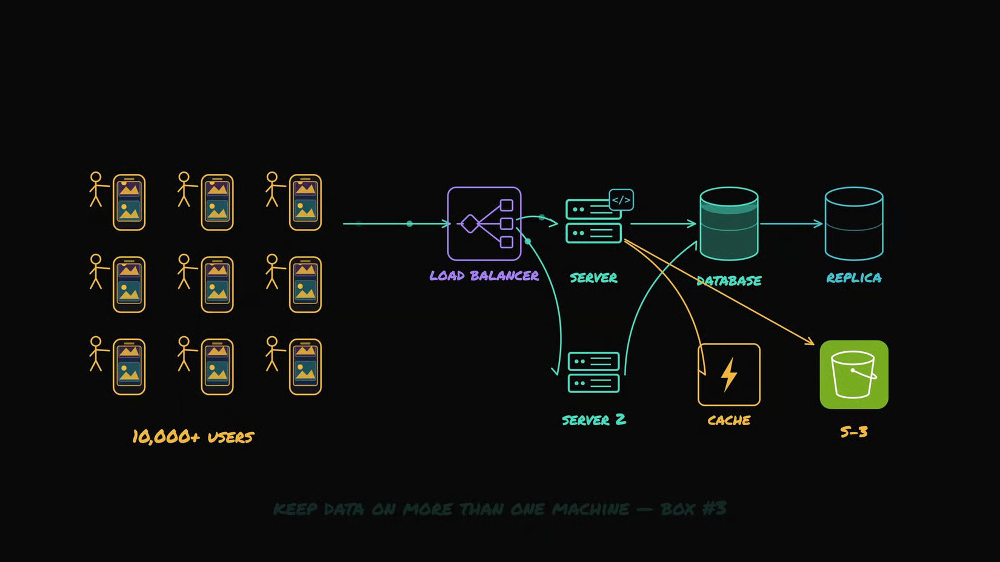
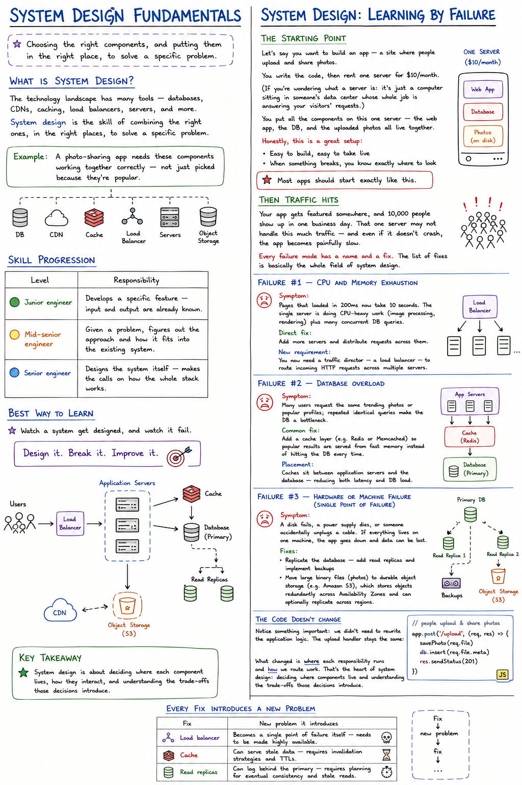

# System Design Fundamentals

> Choosing the right components, and putting them in the right place, to solve a specific problem.

## What is System Design?

The technology landscape has many tools — databases, CDNs, caching, load balancers, servers, and more. **System design** is the skill of combining the right ones, in the right places, to solve a specific problem.

> **Example:** A photo-sharing app needs these components working together correctly — not just picked because they're popular.

## Skill Progression

| Level | Responsibility |
|---|---|
| 🟢 **Junior engineer** | Develops a specific feature — input and output are already known. |
| 🟡 **Mid-senior engineer** | Given a problem, figures out the approach and how it fits into the existing system. |
| 🔵 **Senior engineer** | Designs the system itself — makes the calls on how the whole stack works. |

## Best Way to Learn

> Watch a system get designed, and watch it fail.

---

### *Design it. Break it. Improve it.*

# System Design: Learning by Failure

## The Starting Point

Let's say you want to build an app — a site where people upload and share photos.

You write the code, then rent one server for $10/month. (If you're wondering what a server is: it's just a computer sitting in someone's data center whose whole job is answering your visitors' requests.)

You put all the components on this one server — the web app, the DB, and the uploaded photos all live together.

Honestly, **this is a great setup**:
- Easy to build, easy to take live
- When something breaks, you know exactly where to look

> Most apps should start exactly like this.

## Then Traffic Hits

Your app gets featured somewhere, and 10,000 people show up in one business day. That one server may not handle this much traffic — and even if it doesn't crash, the app becomes painfully slow.

Every failure mode has a name and a fix. The list of fixes is basically the whole field of system design.

---

### Failure #1 — CPU and memory exhaustion

**Symptom:** Pages that loaded in 200ms now take 10 seconds. The single server is doing CPU-heavy work (image processing, rendering) plus many concurrent DB queries.

**Direct fix:** Add more servers and distribute requests across them.

**New requirement:** You now need a traffic director — a **load balancer** — to route incoming HTTP requests across multiple servers.

---

### Failure #2 — Database overload

**Symptom:** Many users request the same trending photos or popular profiles; repeated identical queries make the DB a bottleneck.

**Common fix:** Add a **cache layer** (e.g. Redis or Memcached) so popular results are served from fast memory instead of hitting the DB every time.

**Placement:** Caches sit *between* application servers and the database — reducing both latency and DB load.

---

### Failure #3 — Hardware or machine failure (single point of failure)

**Symptom:** A disk fails, a power supply dies, or someone accidentally unplugs a cable. If everything lives on one machine, the app goes down and data can be lost.

**Fixes:**
- Replicate the database — add read replicas and implement backups
- Move large binary files (photos) to durable **object storage** (e.g. Amazon S3), which stores objects redundantly across Availability Zones and can optionally replicate across regions

---

## The Code Doesn't Change

Notice something important: we didn't need to rewrite the application logic. The upload handler stays the same:

```js
// people upload & share photos
app.post('/upload', (req, res) => {
    savePhoto(req.file)
    db.insert(req.file.meta)
    res.sendStatus(201)
})
```

What changed is **where** each responsibility runs and **how** we route work. That's the heart of system design: deciding where components live and understanding the trade-offs those decisions introduce.



## Every Fix Introduces a New Problem

| Fix | New problem it introduces |
|---|---|
| Load balancer | Becomes a single point of failure itself — needs to be made highly available |
| Cache | Can serve stale data — requires invalidation strategies and TTLs |
| Read replicas | Can lag behind the primary — requires planning for eventual consistency and stale reads |

> Fix → new problem → fix → ...

## The Takeaway

You don't learn system design by memorizing diagrams; you learn by **observing components fail, reasoning about trade-offs, and making pragmatic choices**.

When someone asks how you'd scale an app, aim to describe a logical approach: identify bottlenecks, choose mitigations, and balance correctness, cost, and complexity — rather than reciting a single static diagram.


