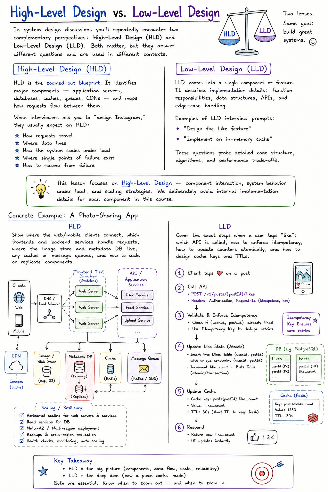

# High-Level Design vs. Low-Level Design

In system design discussions you'll repeatedly encounter two complementary perspectives: **High-Level Design (HLD)** and **Low-Level Design (LLD)**. Both matter, but they answer different questions and are used in different contexts.

## High-Level Design (HLD)

HLD is the **zoomed-out blueprint**. It identifies major components — application servers, databases, caches, queues, CDNs — and maps how requests flow between them.

When interviewers ask you to "design Instagram," they usually expect an HLD:
- How requests travel
- Where data lives
- How the system scales under load
- Where single points of failure exist
- How to recover from failure

## Low-Level Design (LLD)

LLD zooms into a **single component or feature**. It describes implementation details: function responsibilities, data structures, APIs, and edge-case handling.

Examples of LLD interview prompts:
- "Design the Like feature"
- "Implement an in-memory cache"

These questions probe detailed code structure, algorithms, and performance trade-offs.

> This lesson focuses on **High-Level Design** — component interaction, system behavior under load, and scaling strategies. We deliberately avoid internal implementation details for each component in this course.

## Concrete Example: A Photo-Sharing App

**HLD:** Show where the web/mobile clients connect, which frontends and backend services handle requests, where the image store and metadata DB live, any caches or message queues, and how to scale or replicate components.

**LLD:** Cover the exact steps when a user taps "like": which API is called, how to enforce idempotency, how to update counters atomically, and how to design cache keys and TTLs.

## Comparison at a Glance

| Aspect | High-Level Design (HLD) | Low-Level Design (LLD) |
|---|---|---|
| **Scope** | System architecture, major components, data flow | Component internals, functions, classes, data structures |
| **Questions answered** | "Where do requests go?" "How does the system scale?" | "What happens when this API is called?" "How to avoid double-counting?" |
| **Artifacts** | Architecture diagrams, component diagrams, deployment topology | Sequence diagrams, interface definitions, code snippets, pseudocode |
| **Interview examples** | "Design Instagram", "Design a scalable messaging system" | "Design the Like feature", "Implement an LRU cache" |
| **Deliverables** | Service boundary definitions, scaling and redundancy plan | API design, algorithms, concurrency control, optimizations |

## Interview Scenario

An interviewer might ask candidates to design different features:
- **"Design Instagram"** → HLD
- **"Design the Like feature"** → LLD
- **"Design an in-memory cache"** → LLD

## LLD Example (For Contrast Only)

Below is a short LLD-style example showing the kind of code-level detail this HLD-focused course intentionally does not cover. It illustrates cache lookups, database checks, and count updates for a "like" action.

> **Note:** this is illustrative only.

```js
import { db, cache } from "./store";

async function handleLike(userId, photoId) {
  if (await hasLiked(userId, photoId)) return;
  await saveLike(userId, photoId);
  await bumpCount(photoId);
}

async function hasLiked(userId, photoId) {
  // Check cache first for speed
  const key = `likes:${userId}:${photoId}`;
  const cached = await cache.get(key);
  if (cached !== null) return Boolean(cached);

  // Fallback to the database
  const exists = await db.likes.exists({ userId, photoId });

  // Cache the result for a short time
  await cache.set(key, exists ? 1 : 0, { ttl: 300 });
  return exists;
}
```

