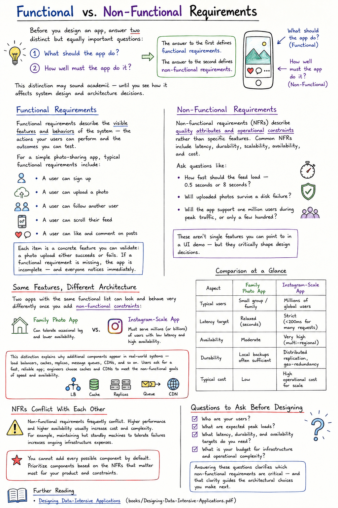

# Functional vs. Non-Functional Requirements

Before you design an app, answer two distinct but equally important questions:

1. **What should the app do?**
2. **How well must the app do it?**

The answer to the first defines **functional requirements**. The answer to the second defines **non-functional requirements**. This distinction may sound academic — until you see how it affects system design and architecture decisions.

## Functional Requirements

Functional requirements describe the visible features and behaviors of the system — the actions your users can perform and the outcomes you can test.

For a simple photo-sharing app, typical functional requirements include:

- A user can sign up
- A user can upload a photo
- A user can follow another user
- A user can scroll their feed
- A user can like and comment on posts

Each item is a concrete feature you can validate: a photo upload either succeeds or fails. If a functional requirement is missing, the app is incomplete — and everyone notices immediately.

## Non-Functional Requirements

Non-functional requirements (NFRs) describe **quality attributes and operational constraints** rather than specific features. Common NFRs include latency, durability, scalability, availability, and cost. These requirements drive architectural choices even though users never ask for them explicitly.

Ask questions like:
- How fast should the feed load — 0.5 seconds or 8 seconds?
- Will uploaded photos survive a disk failure?
- Will the app support one million users during peak traffic, or only a few hundred?

These aren't single features you can point to in a UI demo — but they critically shape design decisions.

## Same Features, Different Architecture

Two apps with the same functional list can look and behave very differently once you add non-functional constraints:

- A **family photo app** can tolerate occasional lag and lower availability.
- **Instagram** must serve millions (or billions) of users with low latency and high availability.

This distinction explains why additional components appear in real-world systems — load balancers, caches, replicas, message queues, CDNs, and so on. Users ask for a fast, reliable app; engineers choose caches and CDNs to meet the non-functional goals of speed and availability.

### Comparison at a Glance

| Aspect | Family Photo App | Instagram-Scale App |
|---|---|---|
| **Typical users** | Small group / family | Millions of global users |
| **Latency target** | Relaxed (seconds) | Strict (<200ms for many requests) |
| **Availability** | Moderate | Very high (multi-regional) |
| **Durability** | Local backups often sufficient | Distributed replication, geo-redundancy |
| **Typical cost** | Low | High operational cost for scale |

## NFRs Conflict With Each Other

Non-functional requirements frequently conflict. Higher performance and higher availability usually increase cost and complexity. For example, maintaining hot standby machines to tolerate failures increases ongoing infrastructure expenses.

> You cannot add every possible component by default. Prioritize components based on the NFRs that matter most for your product and constraints.

## Questions to Ask Before Designing

- Who are your users?
- What are expected peak loads?
- What latency, durability, and availability targets do you need?
- What is your budget for infrastructure and operational complexity?

Answering these questions clarifies which non-functional requirements are critical — and that clarity guides the architectural choices you make next.

## Further Reading
- [*Designing Data-Intensive Applications*](books/Designing-Data-Intensive-Applications.pdf)

