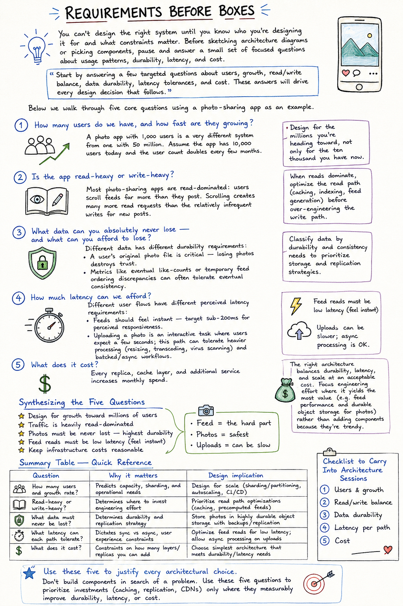

# Requirements Before Boxes

You can't design the right system until you know who you're designing it for and what constraints matter. Before sketching architecture diagrams or picking components, pause and answer a small set of focused questions about usage patterns, durability, latency, and cost.

> Start by answering a few targeted questions about users, growth, read/write balance, data durability, latency tolerances, and cost. These answers will drive every design decision that follows.

Below we walk through five core questions using a photo-sharing app as an example.

## 1. How many users do we have, and how fast are they growing?

A photo app with 1,000 users is a very different system from one with 50 million. Assume the app has 10,000 users today and the user count doubles every few months.

> Design for the millions you're heading toward, not only for the ten thousand you have now.

## 2. Is the app read-heavy or write-heavy?

Most photo-sharing apps are **read-dominated**: users scroll feeds far more than they post. Scrolling creates many more read requests than the relatively infrequent writes for new posts.

> When reads dominate, optimize the read path (caching, indexing, feed generation) before over-engineering the write path.

## 3. What data can you absolutely never lose — and what can you afford to lose?

Different data has different durability requirements:

- A user's **original photo file** is critical — losing photos destroys trust.
- Metrics like eventual **like-counts** or temporary feed ordering discrepancies can often tolerate eventual consistency.

> Classify data by durability and consistency needs to prioritize storage and replication strategies.

## 4. How much latency can we afford?

Different user flows have different perceived latency requirements:

- **Feeds** should feel instant — target sub-200ms for perceived responsiveness.
- **Uploading a photo** is an interactive task where users expect a few seconds; this path can tolerate heavier processing (resizing, transcoding, virus scanning) and batched/async workflows.

## 5. What does it cost?

Every replica, cache layer, and additional service increases monthly spend.

> The right architecture balances durability, latency, and scale at an acceptable cost. Focus engineering effort where it yields the most value (e.g. feed performance and durable object storage for photos) rather than adding components because they're trendy.

## Synthesizing the Five Questions

For this photo app:

- Design for growth toward **millions of users**
- Traffic is heavily **read-dominated**
- Photos must be **never lost** — highest durability
- **Feed reads** must be low latency (feel instant)
- Keep **infrastructure costs** reasonable

**Feed = the hard part · Photos = safest · Uploads = can be slow**

## Summary Table — Quick Reference

| Question | Why it matters | Design implication |
|---|---|---|
| How many users and growth rate? | Predicts capacity, sharding, and operational needs | Design for scale (sharding/partitioning, autoscaling, CI/CD) |
| Read-heavy or write-heavy? | Determines where to invest engineering effort | Prioritize read path optimizations (caching, precomputed feeds) |
| What data must never be lost? | Determines durability and replication strategy | Store photos in highly durable object storage with backups/replication |
| What latency can each path tolerate? | Dictates sync vs async, user experience constraints | Optimize feed reads for low latency; allow async processing on uploads |
| What does it cost? | Constraints on how many layers/replicas you can add | Choose simplest architecture that meets durability/latency needs |

## Designers vs. Component-Collectors

This mindset — answering requirements before picking components — separates thoughtful system designers from component-collectors.

Anyone can say "add cache"; the real skill is justifying **why** the app needs it and calculating the trade-offs in cost and complexity.

> Don't build components in search of a problem. Use these five questions to prioritize investments (caching, replication, CDNs) only where they measurably improve durability, latency, or cost.

## Checklist to Carry Into Architecture Sessions

1. Users & growth
2. Read/write balance
3. Data durability
4. Latency per path
5. Cost

Use these five to justify every architectural choice.

