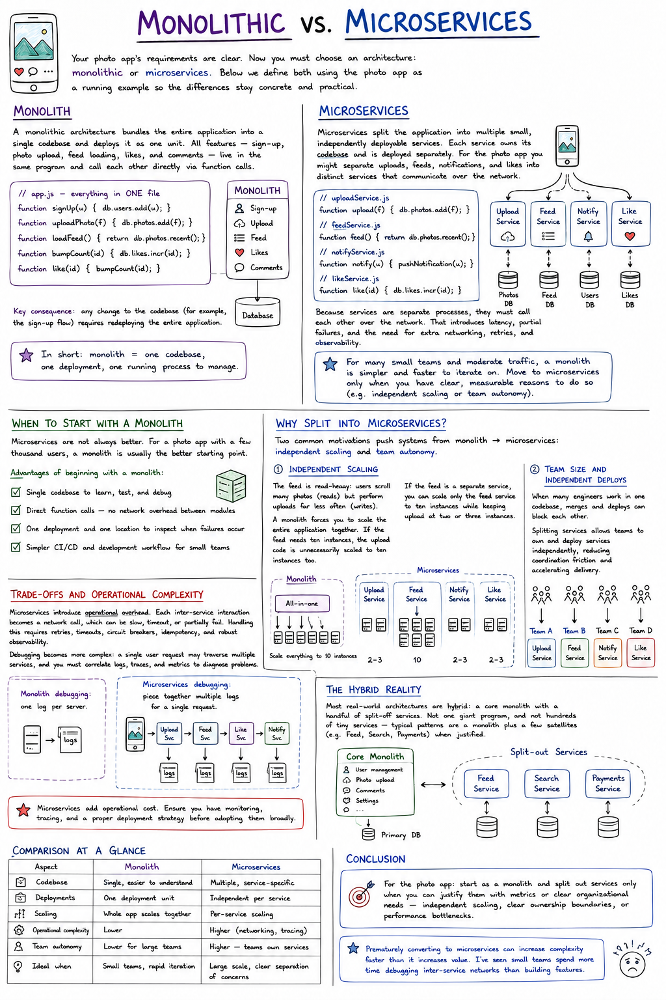

# Monolithic vs. Microservices

Your photo app's requirements are clear. Now you must choose an architecture: **monolithic** or **microservices**? Below we define both using the photo app as a running example so the differences stay concrete and practical.

## Monolith

A monolithic architecture bundles the entire application into a single codebase and deploys it as one unit. All features — sign-up, photo upload, feed loading, likes, and comments — live in the same program and call each other directly via function calls.

```js
// app.js - everything in ONE file
function signUp(u) { db.users.add(u); }
function uploadPhoto(f) { db.photos.add(f); }
function loadFeed() { return db.photos.recent(); }
function bumpCount(id) { db.likes.incr(id); }
function like(id) { bumpCount(id); }
```

**Key consequence:** any change to the codebase (for example, the sign-up flow) requires redeploying the entire application.

> In short: monolith = one codebase, one deployment, one running process to manage.

## Microservices

Microservices split the application into multiple small, independently deployable services. Each service owns its codebase and is deployed separately. For the photo app you might separate uploads, feeds, notifications, and likes into distinct services that communicate over the network.

```js
// uploadService.js
function upload(f) { db.photos.add(f); }

// feedService.js
function feed() { return db.photos.recent(); }

// notifyService.js
function notify(u) { pushNotification(u); }

// likeService.js
function like(id) { db.likes.incr(id); }
```

Because services are separate processes, they must call each other over the network. That introduces latency, partial failures, and the need for extra networking, retries, and observability.

> For many small teams and moderate traffic, a monolith is simpler and faster to iterate on. Move to microservices only when you have clear, measurable reasons to do so (e.g. independent scaling or team autonomy).

## When to Start With a Monolith

Microservices are not always better. For a photo app with a few thousand users, a monolith is usually the better starting point.

**Advantages of beginning with a monolith:**
- Single codebase to learn, test, and debug
- Direct function calls — no network overhead between modules
- One deployment and one location to inspect when failures occur
- Simpler CI/CD and development workflow for small teams

## Why Split Into Microservices?

Two common motivations push systems from monolith → microservices: **independent scaling** and **team autonomy**.

### Independent Scaling

The feed is read-heavy: users scroll many photos (reads) but perform uploads far less often (writes). A monolith forces you to scale the entire application together. If the feed needs ten instances, the upload code is unnecessarily scaled to ten instances too.

If the feed is a separate service, you can scale only the feed service to ten instances while keeping upload at two or three instances.

### Team Size and Independent Deploys

When many engineers work in one codebase, merges and deploys can block each other. Splitting services allows teams to own and deploy services independently, reducing coordination friction and accelerating delivery.

## Trade-offs and Operational Complexity

Microservices introduce operational overhead. Each inter-service interaction becomes a network call, which can be slow, timeout, or partially fail. Handling this requires retries, timeouts, circuit breakers, idempotency, and robust observability.

Debugging becomes more complex: a single user request may traverse multiple services, and you must correlate logs, traces, and metrics to diagnose problems.

> **Monolith debugging:** one log per server.
> **Microservices debugging:** piece together multiple logs for a single request.

> Microservices add operational cost. Ensure you have monitoring, tracing, and a proper deployment strategy before adopting them broadly.

## The Hybrid Reality

Most real-world architectures are hybrid: **a core monolith with a handful of split-off services**. Not one giant program, and not hundreds of tiny services — typical patterns are a monolith plus a few satellites (e.g. Feed, Search, Payments) when justified.

## Comparison at a Glance

| Aspect | Monolith | Microservices |
|---|---|---|
| **Codebase** | Single, easier to understand | Multiple, service-specific |
| **Deployments** | One deployment unit | Independent per service |
| **Scaling** | Whole app scales together | Per-service scaling |
| **Operational complexity** | Lower | Higher (networking, tracing) |
| **Team autonomy** | Lower for large teams | Higher — teams own services |
| **Ideal when** | Small teams, rapid iteration | Large scale, clear separation of concerns |

## Conclusion

For the photo app: start as a monolith and split out services only when you can justify them with metrics or clear organizational needs — independent scaling, clear ownership boundaries, or performance bottlenecks.

> Prematurely converting to microservices can increase complexity faster than it increases value. I've seen small teams spend more time debugging inter-service networks than building features.

## Links and References

- Microservices vs Monoliths — Martin Fowler: https://martinfowler.com/articles/microservices.html
- Kubernetes Documentation: https://kubernetes.io/docs/home/

