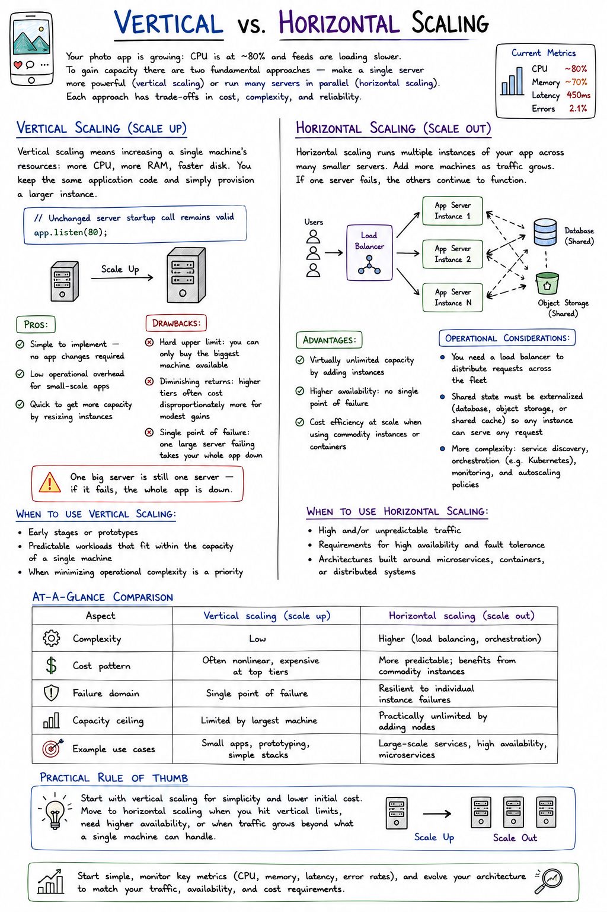

# Vertical vs. Horizontal Scaling

Your photo app is growing: CPU is at ~80% and feeds are loading slower. To gain capacity there are two fundamental approaches — make a single server more powerful (**vertical scaling**) or run many servers in parallel (**horizontal scaling**). Each approach has trade-offs in cost, complexity, and reliability.

## Vertical Scaling (Scale Up)

Vertical scaling means increasing a single machine's resources: more CPU, more RAM, faster disk. You keep the same application code and simply provision a larger instance.

```js
// Unchanged server startup call remains valid
app.listen(80);
```

**Pros:**
- Simple to implement — no app changes required
- Low operational overhead for small-scale apps
- Quick to get more capacity by resizing instances

**Drawbacks:**
- **Hard upper limit:** you can only buy the biggest machine available
- **Diminishing returns:** higher tiers often cost disproportionately more for modest gains
- **Single point of failure:** one large server failing takes your whole app down

> One big server is still one server — if it fails, the whole app is down.

**When to use vertical scaling:**
- Early stages or prototypes
- Predictable workloads that fit within the capacity of a single machine
- When minimizing operational complexity is a priority

## Horizontal Scaling (Scale Out)

Horizontal scaling runs multiple instances of your app across many smaller servers. Add more machines as traffic grows. If one server fails, the others continue to function.

**Advantages:**
- Virtually unlimited capacity by adding instances
- Higher availability: no single point of failure
- Cost efficiency at scale when using commodity instances or containers

**Operational considerations:**
- You need a **load balancer** to distribute requests across the fleet
- Shared state must be externalized (database, object storage, or shared cache) so any instance can serve any request
- More complexity: service discovery, orchestration (e.g. Kubernetes), monitoring, and autoscaling policies

**When to use horizontal scaling:**
- High and/or unpredictable traffic
- Requirements for high availability and fault tolerance
- Architectures built around microservices, containers, or distributed systems

## At-a-Glance Comparison

| Aspect | Vertical scaling (scale up) | Horizontal scaling (scale out) |
|---|---|---|
| **Complexity** | Low | Higher (load balancing, orchestration) |
| **Cost pattern** | Often nonlinear, expensive at top tiers | More predictable; benefits from commodity instances |
| **Failure domain** | Single point of failure | Resilient to individual instance failures |
| **Capacity ceiling** | Limited by largest machine | Practically unlimited by adding nodes |
| **Example use cases** | Small apps, prototyping, simple stacks | Large-scale services, high availability, microservices |

## Practical Rule of Thumb

> Start with vertical scaling for simplicity and lower initial cost. Move to horizontal scaling when you hit vertical limits, need higher availability, or when traffic grows beyond what a single machine can handle.

## Further Reading

- [Kubernetes: Concepts](https://kubernetes.io/docs/concepts/overview/what-is-kubernetes/)
- [Load balancing patterns](https://en.wikipedia.org/wiki/Load_balancing_(computing))
- [Object storage for shared assets (S3-like)](https://aws.amazon.com/s3/)

---

Start simple, monitor key metrics (CPU, memory, latency, error rates), and evolve your architecture to match your traffic, availability, and cost requirements.

