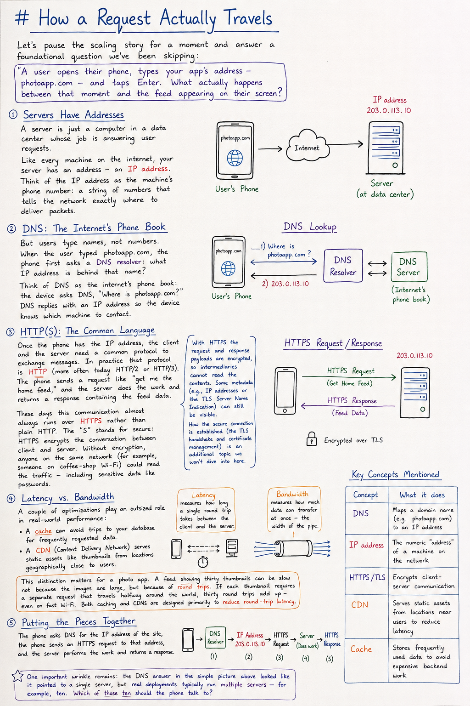

# How a Request Actually Travels

Let's pause the scaling story for a moment and answer a foundational question we've been skipping:

A user opens their phone, types your app's address — `photoapp.com` — and taps Enter. What actually happens between that moment and the feed appearing on their screen?

## Servers Have Addresses

Quick reminder: a server is just a computer in a data center whose job is answering user requests. Like every machine on the internet, your server has an address — an **IP address**. Think of the IP address as the machine's phone number: a string of numbers that tells the network exactly where to deliver packets.

## DNS: The Internet's Phone Book

But users type names, not numbers. When the user typed `photoapp.com`, the phone first asks a DNS resolver: what IP address is behind that name? This lookup is performed by the **Domain Name System (DNS)**.

Think of DNS as the internet's phone book: the device asks DNS, "Where is `photoapp.com`?" DNS replies with an IP address so the device knows which machine to contact.

## HTTP(S): The Common Language

Once the phone has the IP address, the client and the server need a common protocol to exchange messages. In practice that protocol is **HTTP** (more often today HTTP/2 or HTTP/3). The phone sends a request like "get me the home feed," and the server does the work and returns a response containing the feed data.

These days this communication almost always runs over **HTTPS** rather than plain HTTP. The "S" stands for secure: HTTPS encrypts the conversation between client and server. Without encryption, anyone on the same network (for example, someone on coffee-shop Wi-Fi) could read the traffic — including sensitive data like passwords.

With HTTPS the request and response payloads are encrypted, so intermediaries cannot read the contents. Some metadata (for example, IP addresses or the TLS Server Name Indication) can still be visible. How the secure connection is established (the TLS handshake and certificate management) is an additional topic we won't dive into here.

## Latency vs. Bandwidth

A couple of optimizations play an outsized role in real-world performance:

- A **cache** can avoid trips to your database for frequently requested data.
- A **CDN** (Content Delivery Network) serves static assets like thumbnails from locations geographically close to users.

> **Latency** measures how long a single round trip takes between the client and the server. **Bandwidth** measures how much data can transfer at once — the width of the pipe.

This distinction matters for a photo app. A feed showing thirty thumbnails can be slow not because the images are large, but because of round trips. If each thumbnail requires a separate request that travels halfway around the world, thirty round trips add up — even on fast Wi-Fi. Both caching and CDNs are designed primarily to reduce round-trip latency.

## Putting the Pieces Together

The phone asks DNS for the IP address of the site, the phone sends an HTTPS request to that address, and the server performs the work and returns a response.

One important wrinkle remains: the DNS answer in the simple picture above looked like it pointed to a single server, but real deployments typically run multiple servers — for example, ten. **Which of those ten should the phone talk to?**

## Key Concepts Mentioned

| Concept | What it does |
|---|---|
| **DNS** | Maps a domain name (e.g. `photoapp.com`) to an IP address |
| **IP address** | The numeric "address" of a machine on the network |
| **HTTPS / TLS** | Encrypts client–server communication |
| **CDN** | Serves static assets from locations near users to reduce latency |
| **Cache** | Stores frequently used data to avoid expensive backend work |

## Further Reading and References

- How the Domain Name System (DNS) works — Google Public DNS docs
- Introduction to TLS / HTTPS — Let's Encrypt docs
- Content Delivery Networks (CDNs) explained — Cloudflare Learning

