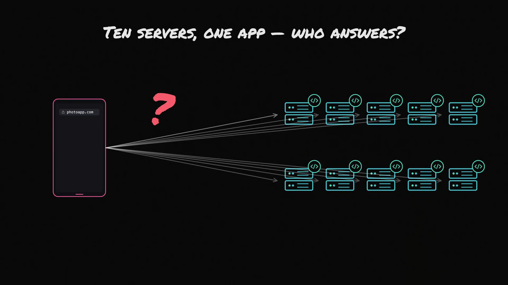
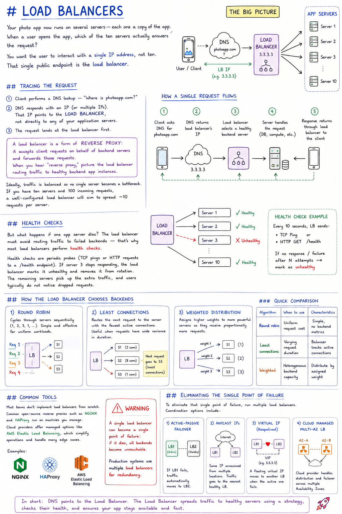

# Load Balancers

Your photo app now runs on several servers — each one a copy of the app. When a user opens the app, which of the ten servers actually answers the request?

You want the user to interact with a **single IP address**, not ten. That single public endpoint is the **load balancer**.

## Tracing the Request

Start by tracing what happens when someone opens the app:

1. The client performs a DNS lookup — "Where is `photoapp.com`?"
2. DNS responds with an IP (or multiple IPs). That IP points to the **load balancer**, not directly to any of your application servers.
3. The request lands at the load balancer first.

A common misconception is that a load balancer is special hardware — in practice it's often just a server running software whose job is to accept incoming requests and forward each request to one of the app servers. It may forward one request to server 2, the next to server 4, and so on, distributing traffic across the fleet.

> A load balancer is a form of **reverse proxy**: it accepts client requests on behalf of backend servers and forwards those requests. When you hear "reverse proxy," picture the load balancer routing traffic to healthy backend app instances.

Ideally, traffic is balanced so no single server becomes a bottleneck. If you have ten servers and 100 incoming requests, a well-configured load balancer will aim to spread ~10 requests per server.

## Health Checks

But what happens if one app server dies? The load balancer must avoid routing traffic to failed backends — that's why most load balancers perform **health checks**.

Health checks are periodic probes (TCP pings or HTTP requests to a `/health` endpoint). If server 3 stops responding, the load balancer marks it unhealthy and removes it from rotation. The remaining servers pick up the extra traffic, and users typically do not notice dropped requests.

## Request Path (Summary)

1. Client asks DNS for `photoapp.com`.
2. DNS returns the load balancer's IP.
3. The load balancer selects a healthy backend server.
4. The selected server handles the request (DB access, computing, etc.).
5. The response returns through the load balancer to the client.

## How the Load Balancer Chooses Backends

- **Round robin:** cycles through servers sequentially (1, 2, 3, 1, ...). Simple and effective for uniform workloads.
- **Least-connections:** routes the next request to the server with the fewest active connections. Useful when requests have wide variance in duration; the balancer maintains counters of open connections per backend.
- **Weighted distribution:** assigns higher weights to more powerful servers so they receive proportionally more requests.

### Quick Comparison

| Algorithm | When to use | Characteristics |
|---|---|---|
| Round robin | Uniform request cost | Simple, no backend metrics |
| Least connections | Varying request duration | Balancer tracks active connections |
| Weighted | Heterogeneous backend capacity | Distribute by assigned weight |

## Common Tools

Most teams don't implement load balancers from scratch. Common open-source reverse proxies such as **NGINX** and **HAProxy** run on machines you manage. Cloud providers offer managed options like **AWS Elastic Load Balancing**, which simplify operations and handle many edge cases.

> **Warning:** a single load balancer can become a single point of failure: if it dies, all backends become unreachable. Production systems use multiple load balancers for redundancy.

## Eliminating the Single Point of Failure

To eliminate that single point of failure, run multiple load balancers. Coordination options include:

- Active-passive failover
- Anycast IPs
- Virtual IPs with tools like `keepalived`
- Cloud-managed multi-AZ load balancing

How you implement failover depends on your infrastructure and availability requirements.

