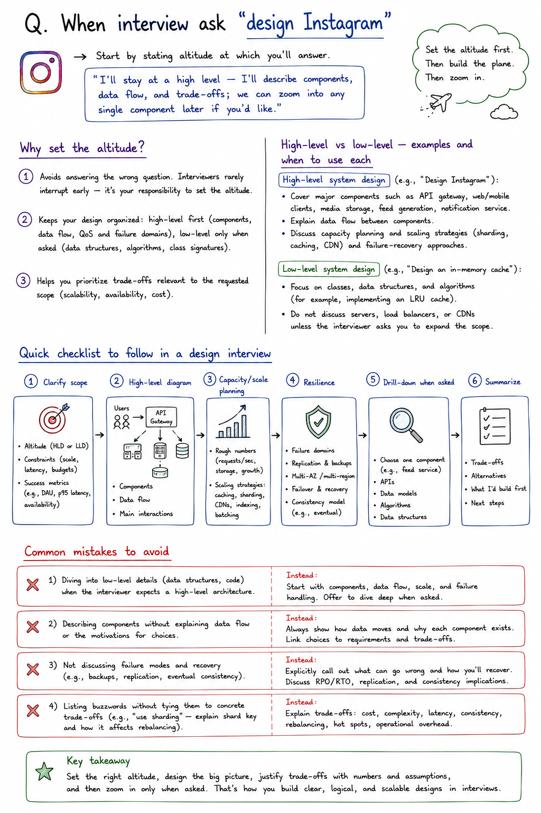

## Q. When interview ask "design Instagram"

Start by stating altitude at which you'll answer.

“I’ll stay at a high level — I’ll describe components, data flow, and trade-offs; we can zoom into any single component later if you’d like.”

#### Why set the altitude?
- Avoids answering the wrong question. Interviewers rarely interrupt early — it’s your responsibility to set the altitude.
- Keeps your design organized: high-level first (components, data flow, QoS and failure domains), low-level only when asked (data structures, algorithms, class signatures).
- Helps you prioritize trade-offs relevant to the requested scope (scalability, availability, cost).

#### High-level vs low-level — examples and when to use each

- High-level system design (e.g., “Design Instagram”): cover major components such as API gateway, web/mobile clients, media storage, feed generation, notification service; explain data flow between components; discuss capacity planning and scaling strategies (sharding, caching, CDN) and failure-recovery approaches.

- Low-level system design (e.g., “Design an in-memory cache”): focus on classes, data structures, and algorithms (for example, implementing an LRU cache); do not discuss servers, load balancers, or CDNs unless the interviewer asks you to expand the scope.

#### Quick checklist to follow in a design interview
- Clarify scope: altitude, constraints (scale, latency, budgets), and success metrics.
- High-level diagram: components and data flow.
- Capacity/scale planning: rough numbers and strategies (caching, sharding, CDNs).
- Resilience: fault domains, replication, failover.
- Drill-down on a single component when asked (include APIs, data models, algorithms).
- Summarize trade-offs and next steps.

#### Common mistakes to avoid
- Diving into low-level details (data structures, code) when the interviewer expects a high-level architecture.
- Describing components without explaining data flow or the motivations for choices.
- Not discussing failure modes and recovery (e.g., backups, replication, eventual consistency).
- Listing buzzwords without tying them to concrete trade-offs (e.g., “use sharding” — explain shard key and how it affects rebalancing).

#### Resources and further reading
System Design Primer: https://github.com/donnemartin/system-design-primer (Important)

Designing Data-Intensive Applications: https://www.oreilly.com/library/view/

designing-data-intensive-applications/9781491903063/part01.html

High Scalability: https://highscalability.com/

