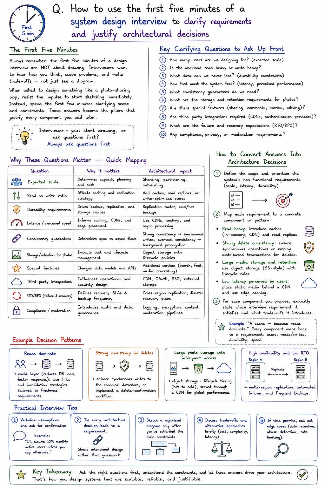

## Q. How to use the first five minutes of a system design interview to clarify requirements and justify architectural decisions

##### The First Five Minutes

Always remember: the first five minutes of a design interview are **not** about drawing. Interviewers want to hear how you think, scope problems, and make trade-offs — not just see a diagram.

When asked to design something like a photo-sharing app, resist the impulse to start sketching immediately. Instead, spend the first few minutes clarifying scope and constraints. Those answers become the pillars that justify every component you add later.

> **Interviewer + you:** start drawing, or ask questions first? Always ask questions first.

#### Key Clarifying Questions to Ask Up Front

1. How many users are we designing for? (expected scale)
2. Is the workload read-heavy or write-heavy?
3. What data can we never lose? (durability constraints)
4. How fast must the system feel? (latency, perceived performance)
5. What consistency guarantees do we need?
6. What are the storage and retention requirements for photos?
7. Are there special features (sharing, comments, stories, editing)?
8. Are third-party integrations required (CDNs, authentication providers)?
9. What are the failure and recovery expectations (RTO/RPO)?
10. Any compliance, privacy, or moderation requirements?

#### Why These Questions Matter — Quick Mapping

| Question | Why it matters | Architectural impact |
|---|---|---|
| Expected scale | Determines capacity planning and cost | Sharding, partitioning, autoscaling |
| Read vs write ratio | Affects caching and replication strategy | Add caches, read replicas, or write-optimized stores |
| Durability requirements | Drives backup, replication, and storage choices | Replication factor, cold/hot backups |
| Latency / perceived speed | Informs caching, CDNs, and edge placement | Use CDNs, caching, and async processing |
| Consistency guarantees | Determines sync vs async flows | Strong consistency → synchronous writes; eventual consistency → background propagation |
| Storage/retention for photos | Impacts cost and lifecycle management | Object storage with lifecycle policies |
| Special features | Changes data models and APIs | Additional services (search, feed, media processing) |
| Third-party integrations | Influences operational and security design | CDN, OAuth, SSO, external storage |
| RTO/RPO | Defines recovery SLAs & backup frequency | Cross-region replication, disaster recovery plans |
| Compliance/moderation | Introduces audit and data governance | Logging, encryption, content moderation pipelines |

#### How to Convert Answers Into Architecture Decisions

1. Define the scope and prioritize the system's non-functional requirements (scale, latency, durability).
2. Map each requirement to a concrete component or pattern:
   - **Read-heavy:** introduce caches (in-memory, CDN) and read replicas.
   - **Strong delete consistency:** ensure synchronous operations or employ distributed transactions for deletes.
   - **Large media storage and retention:** use object storage (S3-style) with lifecycle rules.
   - **Low latency perceived by users:** place static media behind a CDN and use edge caching.
3. For each component you propose, explicitly state which interview requirement it satisfies and what trade-offs it introduces.

#### Example Decision Patterns

- **Reads dominate** → cache layer (reduces DB load, faster responses). Use TTLs and invalidation strategies tailored to freshness requirements.
- **Strong consistency for deletes** → enforce synchronous writes to the canonical datastore, or implement a delete-confirmation workflow.
- **Large photo storage with infrequent access** → object storage + lifecycle tiering (hot to cold), served through a CDN for global performance.
- **High availability and low RTO** → multi-region replication, automated failover, and frequent backups.

> Example: "A cache — because reads dominate." Every component maps back to a requirement: users, reads/writes, durability, speed.

## Practical Interview Tips

- **Verbalize assumptions** and ask for confirmation. Example: *"I'll assume 10M monthly active users unless you say otherwise."*
- **Tie every architecture decision back to a requirement.** This shows intentional design rather than guesswork.
- **Sketch a high-level diagram only after** you've solidified the main constraints.
- **Discuss trade-offs** and alternative approaches briefly (cost, complexity, latency).
- **If time permits, call out edge cases** (data retention, abuse detection, rate limiting).

