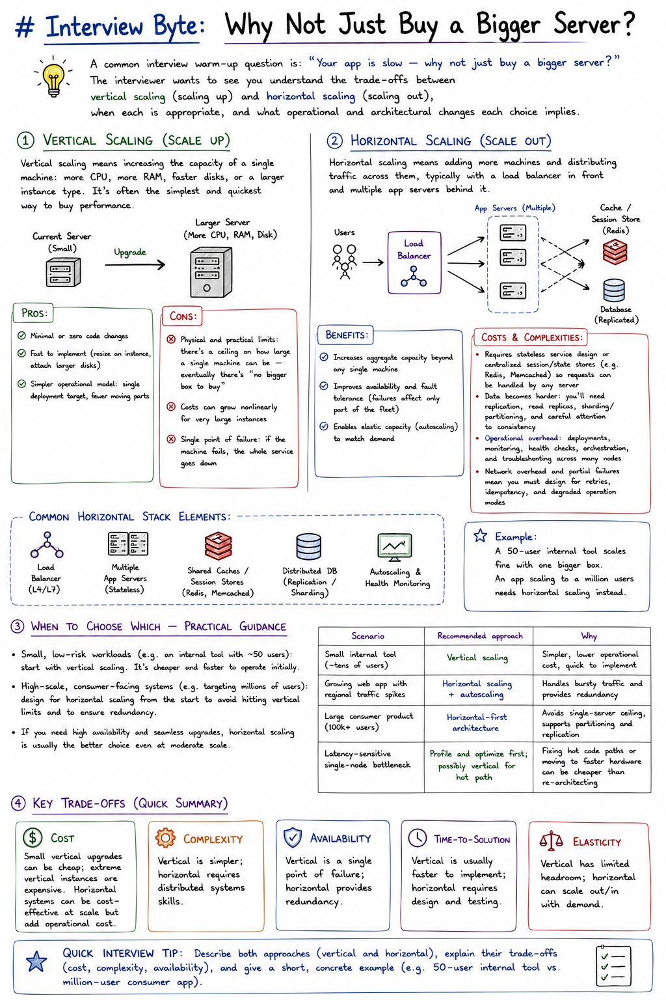

# Interview Byte: Why Not Just Buy a Bigger Server?

A common interview warm-up question is: *"Your app is slow — why not just buy a bigger server?"* The interviewer wants to see you understand the trade-offs between vertical scaling (scaling up) and horizontal scaling (scaling out), when each is appropriate, and what operational and architectural changes each choice implies.

## Vertical Scaling (Scale Up)

Vertical scaling means increasing the capacity of a single machine: more CPU, more RAM, faster disks, or a larger instance type. It's often the simplest and quickest way to buy performance.

**Pros:**
- Minimal or zero code changes
- Fast to implement (resize an instance, attach larger disks)
- Simpler operational model: single deployment target, fewer moving parts

**Cons:**
- **Physical and practical limits:** there's a ceiling on how large a single machine can be — eventually there's "no bigger box to buy"
- Costs can grow nonlinearly for very large instances
- **Single point of failure:** if the machine fails, the whole service goes down

## Horizontal Scaling (Scale Out)

Horizontal scaling means adding more machines and distributing traffic across them, typically with a load balancer in front and multiple app servers behind it.

**Benefits:**
- Increases aggregate capacity beyond any single machine
- Improves availability and fault tolerance (failures affect only part of the fleet)
- Enables elastic capacity (autoscaling) to match demand

**Costs and complexities:**
- Requires stateless service design or centralized session/state stores (e.g. Redis, Memcached) so requests can be handled by any server
- Data becomes harder: you'll need replication, read replicas, sharding/partitioning, and careful attention to consistency
- Operational overhead: deployments, monitoring, health checks, orchestration, and troubleshooting across many nodes
- Network overhead and partial failures mean you must design for retries, idempotency, and degraded operation modes

**Common horizontal stack elements:**
- Load balancer (L4/L7)
- Multiple app servers (stateless or using centralized state)
- Shared caches and session stores
- Distributed database with replication or sharding
- Autoscaling and health monitoring

> Example: a 50-user internal tool scales fine with one bigger box. An app scaling to a million users needs horizontal scaling instead.

## When to Choose Which — Practical Guidance

- **Small, low-risk workloads** (e.g. an internal tool with ~50 users): start with vertical scaling. It's cheaper and faster to operate initially.
- **High-scale, consumer-facing systems** (e.g. targeting millions of users): design for horizontal scaling from the start to avoid hitting vertical limits and to ensure redundancy.
- If you need high availability and seamless upgrades, horizontal scaling is usually the better choice even at moderate scale.

| Scenario | Recommended approach | Why |
|---|---|---|
| Small internal tool (~tens of users) | Vertical scaling | Simpler, lower operational cost, quick to implement |
| Growing web app with regional traffic spikes | Horizontal scaling + autoscaling | Handles bursty traffic and provides redundancy |
| Large consumer product (100k+ users) | Horizontal-first architecture | Avoids single-server ceiling, supports partitioning and replication |
| Latency-sensitive single-node bottleneck | Profile and optimize first; possibly vertical for hot path | Fixing hot code paths or moving to faster hardware can be cheaper than re-architecting |

## Key Trade-offs (Quick Summary)

- **Cost:** small vertical upgrades can be cheap; extreme vertical instances are expensive. Horizontal systems can be cost-effective at scale but add operational cost.
- **Complexity:** vertical is simpler; horizontal requires distributed systems skills.
- **Availability:** vertical is a single point of failure; horizontal provides redundancy.
- **Time-to-solution:** vertical is usually faster to implement; horizontal requires design and testing.

> **Quick interview tip:** describe both approaches (vertical and horizontal), explain their trade-offs (cost, complexity, availability), and give a short, concrete example (e.g. 50-user internal tool vs. million-user consumer app).

## References and Further Reading

- [Vertical scaling (Wikipedia)](https://en.wikipedia.org/wiki/Vertical_scaling)
- [Horizontal scaling (Wikipedia)](https://en.wikipedia.org/wiki/Horizontal_scaling)
- [Load balancing (Wikipedia)](https://en.wikipedia.org/wiki/Load_balancing_(computing))
- Redis — https://redis.io/
- Memcached — https://memcached.org/
- Database replication and sharding — search terms: "database replication", "database sharding", "partitioning"

